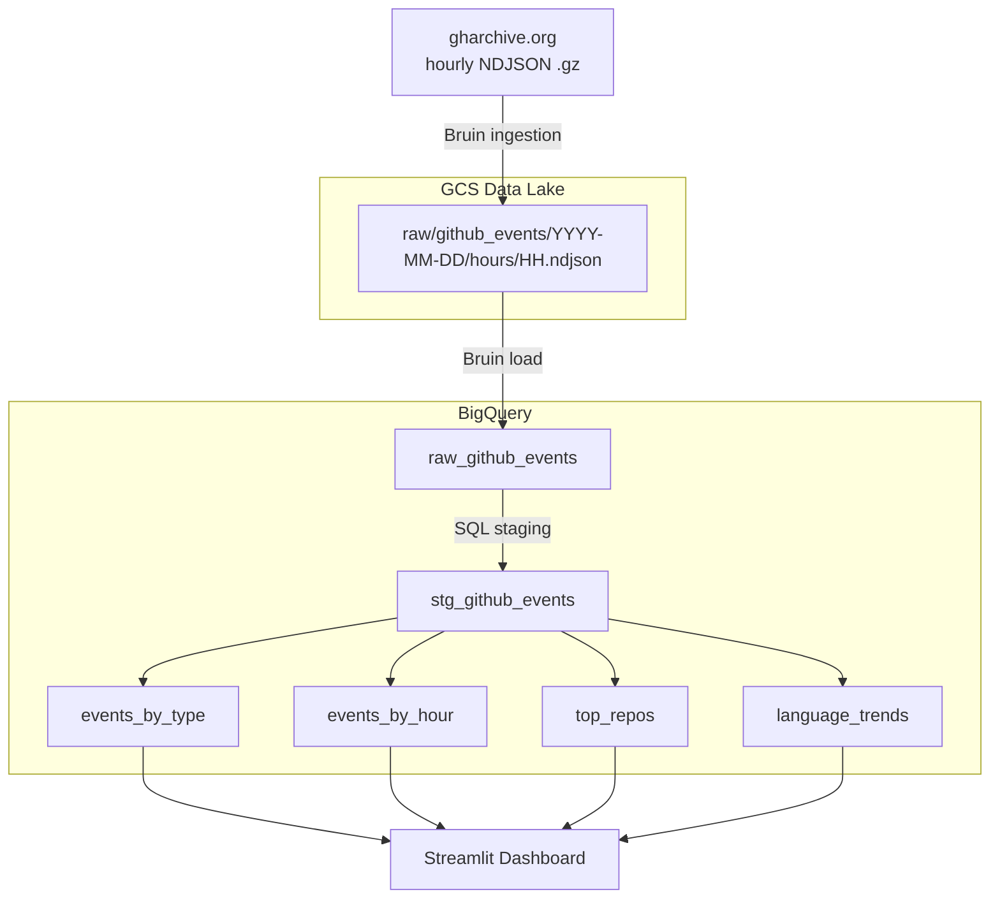

# GitHub Activity Analytics Dashboard

> DataTalks.Club DE Zoomcamp 2026 Final Project

## Problem Description

GitHub generates millions of public events every day — pushes, pull requests, issues, forks, stars — across thousands of repositories and contributors worldwide. This raw activity stream is publicly available via [gharchive.org](https://gharchive.org), but it is not pre-aggregated or directly queryable in a useful analytical form.

**This project builds an end-to-end batch data pipeline that answers:**

- Which event types dominate GitHub activity on any given day or hour?
- Which repositories attract the most contributors and drive the most events?
- How does activity vary across the day (UTC), and what are the peak hours?
- What is the daily mix of event types — is it push-heavy, or driven by issues and PRs?
- Which programming language ecosystems (inferred from repo naming patterns) are most active?

The pipeline ingests hourly NDJSON archives from gharchive.org, lands them in a GCS data lake, loads and stages them in BigQuery, then materialises four analytical marts consumed by a Streamlit dashboard.

## Dashboard

| Event Overview | Top Repositories |
|---|---|
|  |  |

| Language Signals | |
|---|---|
|  | |

## Architecture



## Stack

| Layer | Tool |
|---|---|
| Infrastructure | Terraform |
| Orchestration | Bruin CLI |
| Language | Python 3.12 |
| Package management | uv |
| Data lake | GCS |
| Data warehouse | BigQuery |
| Dashboard | Streamlit |

## Project Structure

```text
bruin/
  assets/
    ingest/
    staging/
    marts/
src/
streamlit_app/
terraform/
tests/
```

## Environments

| Environment | BigQuery dataset |
|---|---|
| dev | dev_gh_analytics |
| staging | stg_gh_analytics |
| prod | gh_analytics |

## Quick Start

### 1. Prerequisites

- GCP project and credentials
- gcloud CLI
- Terraform
- Bruin CLI
- Python 3.12
- uv

### 2. Configure local environment

```bash
uv venv
source .venv/bin/activate
uv pip install -e ".[dev,test]"
cp .env.example .env
```

Fill in `.env` with your project-specific values.

### 3. Bootstrap GCP and infrastructure

The helper script is a convenience bootstrap for local development. Review the defaults in
`scripts/setup-gcp-auto.sh` before running it, especially the project ID and key path.

```bash
bash scripts/setup-gcp-auto.sh
cp terraform/terraform.tfvars.example terraform/terraform.tfvars
# edit terraform/terraform.tfvars with your project-specific values
make infra-apply
```

At minimum, update `project_id` and any globally unique resource names in
`terraform/terraform.tfvars` before applying infrastructure.

### 4. Run the pipeline

```bash
make run-dev-smoke
make run-dev
make run-stg
make run-prod
```

### 5. Run tests

```bash
make test
make test-dev
make test-stg
make test-prod
```

### 6. Run Streamlit locally

```bash
make app-sync
make app-run
```

Local URL: `http://localhost:8501`

## Streamlit Deployment

Deploy the dashboard to Cloud Run:

```bash
make app-gcp-build
make app-deploy
make app-url
```

The app reads the mart tables from `gh_analytics` by default.

## Dashboard Scope

The Streamlit app covers:

- KPI overview
- Event type distribution
- Daily and hourly activity trends
- Top repositories
- Language activity trends
- Optional pipeline admin controls

## Submission Safety

Do not commit any of the following:

- `.env`
- `.bruin.yml`
- `terraform.tfvars`
- service account JSON keys
- private key or certificate files

Safe-to-commit examples are included in:

- `.env.example`
- `terraform/terraform.tfvars.example`

## Notes

- The raw ingestion uses hourly files in GCS to make retries and backfills resumable.
- The BigQuery raw table reload is idempotent per date.
- Streamlit is the only dashboard intended for the final submission.
