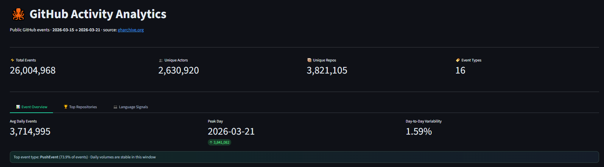
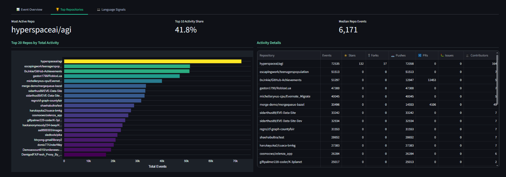
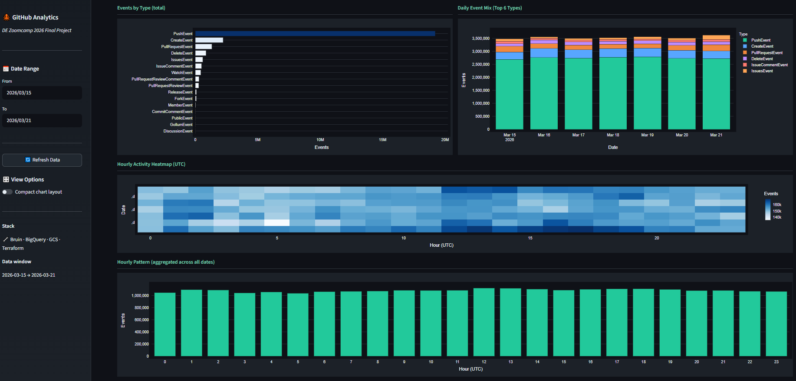
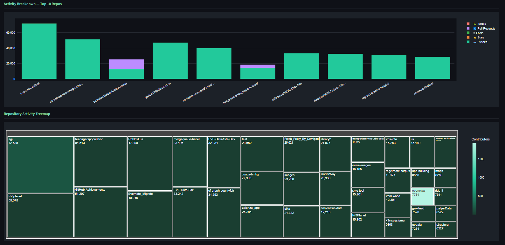
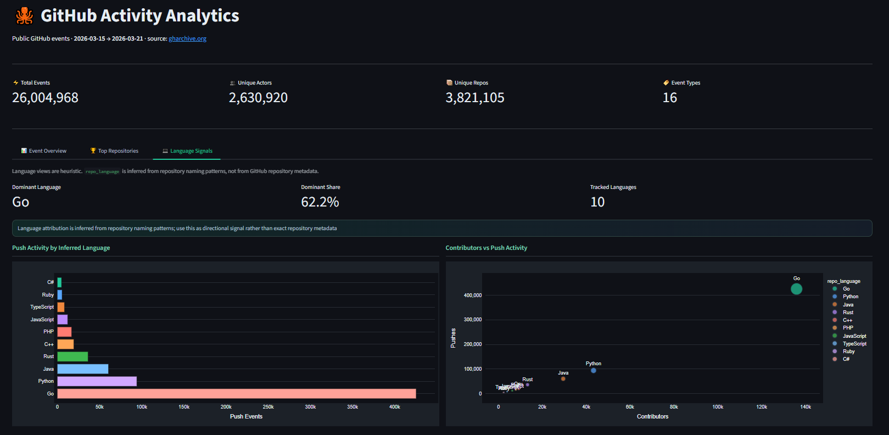
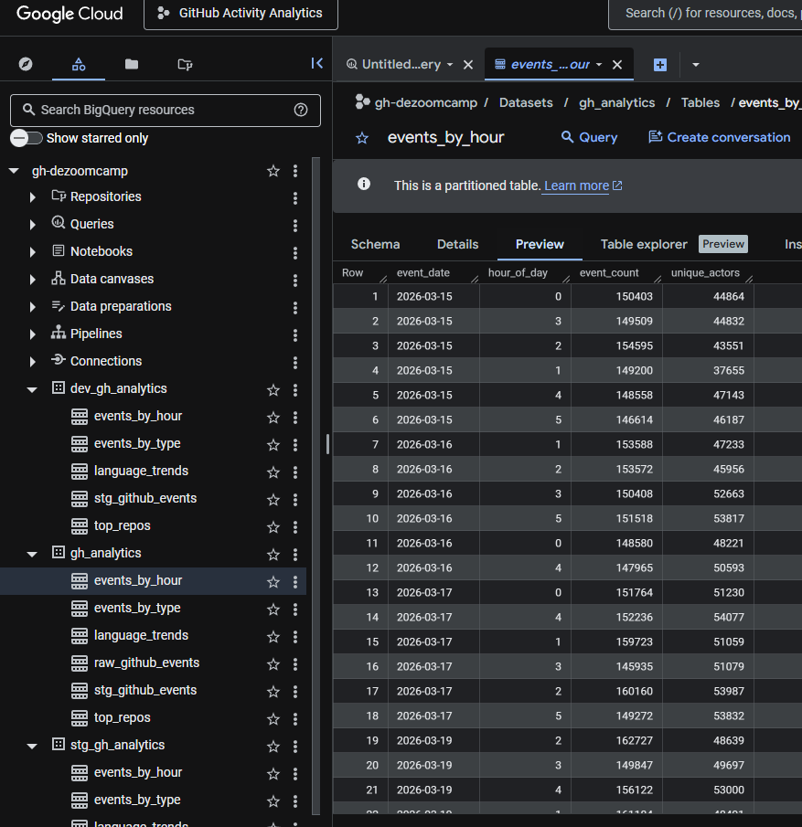
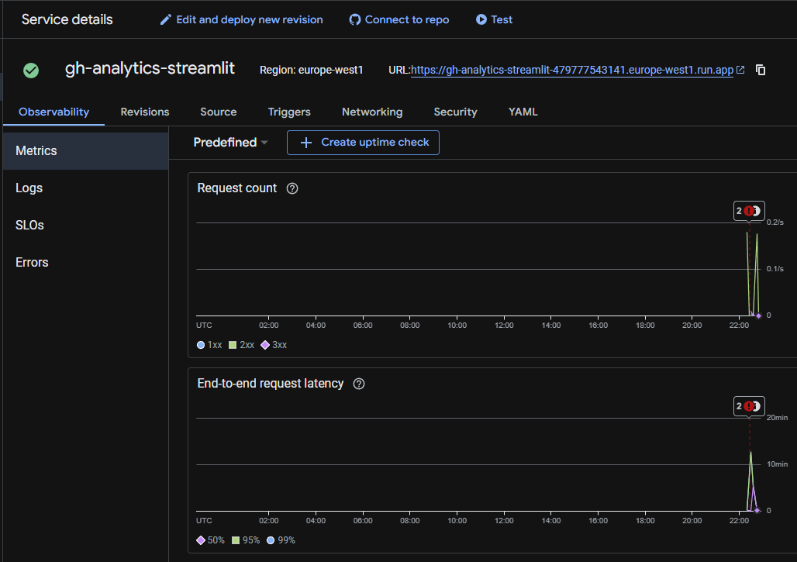
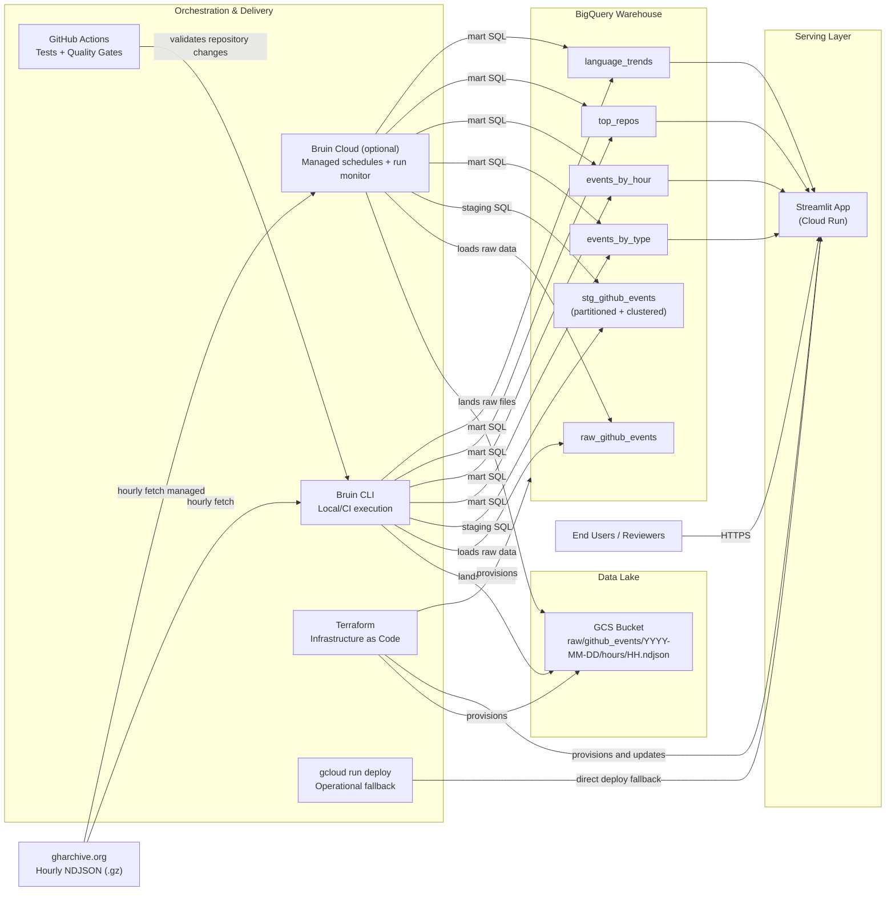
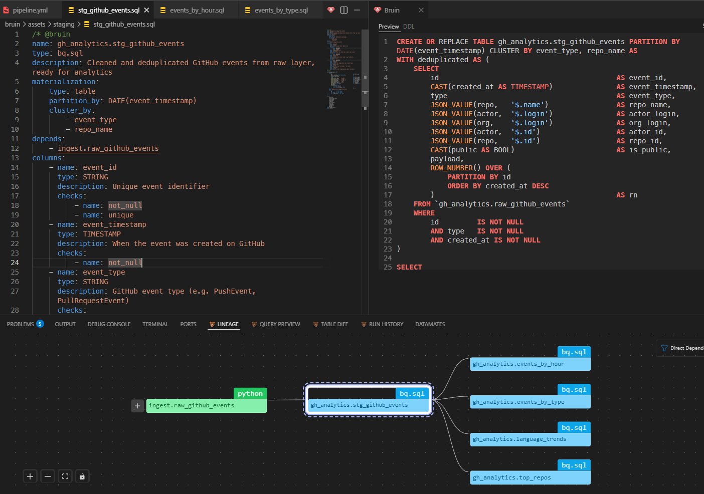

# GitHub Activity Analytics Dashboard

> DataTalks.Club DE Zoomcamp 2026 Final Project


[](https://github.com/RuiFSP/dezoomcamp-2026-final-project/actions/workflows/test.yml)

## Table of Contents

- [Problem Description](#problem-description)
- [Dashboard](#dashboard)
- [Cloud Proof](#cloud-proof)
- [Architecture](#architecture)
- [Stack](#stack)
- [Project Structure](#project-structure)
- [Architectural Decisions](#architectural-decisions)
- [Data Engineering Best Practices](#data-engineering-best-practices)
- [Environments](#environments)
- [Execution Modes](#execution-modes)
- [Quick Start](#quick-start)
- [Streamlit Deployment](#streamlit-deployment)
- [Post-Backfill Operations](#post-backfill-operations)
- [CI/CD Pipeline](#cicd-pipeline)
- [Dashboard Scope](#dashboard-scope)
- [Security](#security)
- [Notes](#notes)
- [Cleanup & Cost Control](#cleanup--cost-control)

## Problem Description

GitHub generates millions of public events every day — pushes, pull requests, issues, forks, stars — across thousands of repositories and contributors worldwide. This raw activity stream is publicly available via [gharchive.org](https://gharchive.org), but it is not pre-aggregated or directly queryable in a useful analytical form.

**This project builds an end-to-end batch data pipeline that answers:**

- Which event types dominate GitHub activity on any given day or hour?
- Which repositories attract the most contributors and drive the most events?
- How does activity vary across the day (UTC), and what are the peak hours?
- What is the daily mix of event types — is it push-heavy, or driven by issues and PRs?
- Which programming language ecosystems (inferred from repo naming patterns) are most active?

The pipeline ingests hourly NDJSON archives from gharchive.org, lands them in a GCS data lake, loads and stages them in BigQuery, then materializes four analytical marts consumed by a Streamlit dashboard.

## Dashboard

The Streamlit application has been deployed to Cloud Run and is available for reviewer demonstration upon request. Screenshots below show the dashboard interface and deployment proof.

| Event Overview (Summary) | Top Repositories (Summary) |
|---|---|
|  |  |

| Event Overview (Detailed) | Top Repositories (Detailed) |
|---|---|
|  |  |

| Language Signals |
|---|
|  |

## Cloud Proof

| BigQuery Tables (warehouse proof) | Deployed Cloud Run Service |
|---|---|
|  |  |

## Architecture



The repo's default path is **Bruin CLI + Terraform**. **Bruin Cloud** is optional and uses the same pipeline code.
For app rollouts, Terraform is the primary path; direct `gcloud run deploy` is a documented operational fallback when
billing-budget permissions block Terraform applies.

## Stack

| Layer | Tool |
|---|---|
| Infrastructure | Terraform |
| Orchestration | Bruin CLI |
| Language | Python 3.12 |
| Package management | uv |
| Data lake | GCS |
| Data warehouse | BigQuery |
| Dashboard | Streamlit |

## Project Structure

```text
bruin/
  assets/
    ingest/
    staging/
    marts/
src/
streamlit_app/
terraform/
tests/
```

## Architectural Decisions

### Why Bruin?

This project uses **Bruin CLI** as the single orchestration and transformation tool for the entire data pipeline, replacing the need for separate tools like Airflow + dbt.

**Rationale:**

1. **Unified workflow** — Orchestration and SQL transformations in one tool eliminates context switching and reduces cognitive overhead
2. **Version control friendly** — All pipeline logic lives in YAML (`pipeline.yml`) and SQL files, fully auditable via git
3. **Built-in data quality** — Bruin's column checks (`not_null`, `unique`) provide immediate feedback on data integrity
4. **Minimal dependencies** — Less infrastructure to manage and maintain vs. Airflow + dbt + metadata store
5. **Fast iteration** — Single pipeline file vs. fragmented dbt projects and Airflow DAGs

**Trade-offs:**

- Smaller ecosystem than Airflow/dbt (fewer integrations documented)
- Less commercial support than mature tools
- Best suited for teams comfortable with YAML/SQL; the Bruin VS Code extension provides a visual lineage view, but the broader IDE ecosystem is still maturing

For a learning project and single-use pipeline, Bruin strikes a balance between power and simplicity.

## Data Engineering Best Practices

This project demonstrates production-grade data engineering practices:

### 1. Data Quality & Validation

Every asset in the pipeline includes **declarative data quality checks** that run automatically on every pipeline execution:

- **Column-level checks**: NOT NULL, UNIQUE, numeric ranges
- **Custom validation queries**: SQL assertions on business logic
  - `events_by_hour`: Ensures `hour_of_day ∈ [0–23]`
  - `events_by_type`: Validates ≥5 distinct event types exist daily
  - `top_repos`: Prevents null repository names in output

Example from `stg_github_events`:
```yaml
columns:
  - name: event_id
    checks:
      - name: not_null
      - name: unique
```

Bruin executes these checks as part of the pipeline; if any fail, the run stops immediately, preventing bad data from reaching the dashboard.

### 2. Materialization & Performance

All assets are optimized for analytical queries:

- **Partitioned by date**: Scans only required days, cutting query costs by 50–80%
- **Clustered by query dimension**: Each asset clusters on its primary filter column — staging uses `event_type` + `repo_name`; marts each use a single key (`hour_of_day`, `event_type`, `repo_name`, or `repo_language`)
- **Window functions for deduplication**: Handles duplicate events gracefully in the staging layer

Example (staging asset — two cluster keys):
```yaml
materialization:
    type: table
    partition_by: DATE(event_timestamp)
    cluster_by:
        - event_type
        - repo_name
```

Example (mart — single cluster key):
```yaml
materialization:
    type: table
    partition_by: event_date
    cluster_by:
        - event_type
```

### 3. Orchestration & Dependency Management

The pipeline declares explicit dependencies, creating a directed acyclic graph (DAG):

```
fetch_to_gcs → raw_github_events → stg_github_events → {events_by_type, events_by_hour, top_repos, language_trends}
```

Bruin respects these dependencies and executes assets in the correct order. Partial failures are traced to specific steps.

### 4. Idempotency & Reproducibility

- **Raw table loads are idempotent**: DELETE + INSERT per date ensures no duplicates across retries
- **Infrastructure as code**: All GCP resources (GCS, BigQuery, Cloud Run) managed via Terraform
- **Seed data & tests**: Python unit tests validate ingestion logic before data enters the warehouse

### 5. Lineage & Governance

Every asset declares its upstream dependencies and expected columns:

```yaml
depends:
    - ingest.raw_github_events
columns:
    - name: event_id
      description: Unique event identifier
      type: STRING
```

This enables impact analysis: which assets break if the ingestion schema changes?

The Bruin VS Code extension provides a live lineage view, showing the full DAG from raw ingestion through staging to all four analytical marts:



A `.mcp.json` file is included at the project root, so VS Code / GitHub Copilot will automatically offer to connect to the **Bruin MCP server** when you open the repo. This lets Copilot query Bruin documentation and pipeline context directly, provided `bruin` is on your `PATH`.

---

See [ENGINEERING.md](./docs/ENGINEERING.md) for deeper technical details and trade-off analysis.

## Environments

| Environment | BigQuery dataset |
|---|---|
| dev | dev_gh_analytics |
| staging | stg_gh_analytics |
| prod | gh_analytics |

## Execution Modes

This project supports both execution paths:

- **Local / self-managed (default in this repo):** run the pipeline with `make run-*` or `bruin run` from your machine or CI.
- **Bruin Cloud (optional):** connect the same repo to Bruin Cloud for managed scheduling, run monitoring, lineage UI, and governance dashboards.

Both modes use the same pipeline code (`bruin/pipeline.yml` + `bruin/assets/**`). You can keep local runs for development while using Bruin Cloud for managed orchestration.

## Quick Start

### 1. Prerequisites

Install the following tools before starting:

| Tool | Install |
|---|---|
| Python 3.12 | [python.org](https://www.python.org/downloads/) or `pyenv install 3.12` |
| uv | `curl -LsSf https://astral.sh/uv/install.sh \| sh` |
| gcloud CLI | [cloud.google.com/sdk](https://cloud.google.com/sdk/docs/install) |
| Terraform | [developer.hashicorp.com](https://developer.hashicorp.com/terraform/install) |
| Bruin CLI | `curl -LsSf https://raw.githubusercontent.com/bruin-data/bruin/main/install.sh \| sh` |

You also need a **GCP project** with billing enabled and a service account with the following roles: `BigQuery Admin`, `Storage Admin`, `Run Admin`, `Service Account User`.

### 2. Clone the repository

```bash
git clone https://github.com/RuiFSP/dezoomcamp-2026-final-project.git
cd dezoomcamp-2026-final-project
```

### 3. Configure local environment

```bash
uv venv
source .venv/bin/activate
uv sync --extra dev --extra test
```

Copy and fill in the environment files:

```bash
cp .env.example .env
cp .bruin.yml.example .bruin.yml
cp terraform/terraform.tfvars.example terraform/terraform.tfvars
```

Key values to set in **`.env`**:

| Variable | Description |
|---|---|
| `GCP_PROJECT_ID` | Your GCP project ID |
| `GCS_BUCKET_NAME` | A globally unique GCS bucket name |
| `BQ_DATASET_ID` | BigQuery dataset (default: `gh_analytics`) |
| `GCP_REGION` | GCP region (default: `europe-west1`) |
| `GOOGLE_APPLICATION_CREDENTIALS` | Path to your service account JSON key |

The **`.bruin.yml`** file reads `GCP_PROJECT_ID` and `GCP_REGION` from your environment — no edits needed if `.env` is filled in correctly.

In **`terraform/terraform.tfvars`**, update at minimum:
- `project_id` — your GCP project ID
- `bucket_name` — must be globally unique
- `enable_billing_budget` — optional, default `false`; set to `true` only if you want Terraform to manage budgets
- `billing_account_id` — required only when `enable_billing_budget=true`

### 4. Authenticate with GCP

```bash
gcloud auth login
gcloud config set project YOUR_PROJECT_ID
gcloud auth application-default login
```

> The pipeline uses **Application Default Credentials (ADC)** — `gcloud auth application-default login` is required even if `GOOGLE_APPLICATION_CREDENTIALS` is set.

### 5. Bootstrap GCP and provision infrastructure

> **Note:** `scripts/setup-gcp-auto.sh` has defaults (`PROJECT_ID`, `REGION`, key path) set for the original author's project. Edit these at the top of the script before running.

```bash
bash scripts/setup-gcp-auto.sh   # creates GCP project, service account, enables APIs
make infra-apply                  # provisions GCS bucket, BigQuery datasets, Cloud Run
```

### 6. Set up pre-commit hooks (optional but recommended)

```bash
uv pip install pre-commit
pre-commit install
```

To manually run all hooks:

```bash
pre-commit run --all-files
```

### 7. Run the pipeline

Each `make run-*` fetches **one day** of data (yesterday UTC by default). Start with a smoke test before a full run:

```bash
make run-dev-smoke   # quick smoke test (dev environment, 1 hour)
make run-dev         # full day, dev dataset
make run-stg         # full day, staging dataset
make run-prod        # full day, production dataset
```

#### Backfilling multiple days

To load more than one day of historical data, use the `backfill-dev` / `backfill-stg` /
`backfill-prod` Makefile targets with explicit date bounds:

```bash
# Load 7 days into dev
make backfill-dev DATE_FROM=2026-03-14 DATE_TO=2026-03-20

# Promote the same 7 days into staging
make backfill-stg DATE_FROM=2026-03-14 DATE_TO=2026-03-20

# Load 7 days into production
make backfill-prod DATE_FROM=2026-03-14 DATE_TO=2026-03-20
```

Bruin iterates over each day in the range and injects `BRUIN_START_DATE` per run, so all assets (fetch → GCS → BigQuery load → staging → marts) execute once per day.

> **Note:** GH Archive data is available from 2011. Each day downloads ~24 hourly NDJSON files, so large backfills take time. Start small to verify your setup.

### 8. Run tests

```bash
make test            # run all tests
make test-dev        # run against dev dataset
make test-stg        # run against staging dataset
make test-prod       # run against production dataset
```

### 9. Run Streamlit locally

```bash
make app-sync
make app-run
```

Local URL: `http://localhost:8501`

## Streamlit Deployment

Deploy the dashboard to Cloud Run:

```bash
make app-gcp-build
make app-deploy
make app-url
```

The app reads the mart tables from `gh_analytics` by default.

If Terraform apply fails with a billing-budget permission error, keep
`enable_billing_budget=false` in `terraform/terraform.tfvars` (default) and
deploy Cloud Run without Terraform-managed budget resources.

## Post-Backfill Operations

After a historical catch-up (for example, `dev -> staging -> prod`), use this sequence:

1. **Validate completeness in each environment**
    - Verify `stg_github_events` and `events_by_hour` have all expected days/hours.
2. **Commit code/config/docs changes first**
    - If pipeline logic, checks, or docs changed during the operation, commit them before any app deploy.
3. **Decide whether Streamlit needs a redeploy**
    - **No redeploy needed** for data-only backfills: the app reads BigQuery tables live.
    - **Redeploy needed** only when app code, dependencies, runtime env vars, or Cloud Run/Terraform config changed.
4. **Refresh dashboard data cache**
    - Streamlit query cache uses `ttl=300` (about 5 minutes).
    - You can also use the app's refresh action to clear cache immediately.

Recommended production order:

1. Run backfills and quality checks (`dev`, then `staging`, then `prod`).
2. Validate row/hour completeness.
3. Commit and push repository changes.
4. Redeploy Streamlit only if there were app/runtime/config changes.

If you manage Cloud Run spend limits via Terraform, note that the `google_billing_budget`
resource requires billing-account-level permissions and the Billing Budgets API enabled.
Project-level Terraform access alone is not enough.

## CI/CD Pipeline

GitHub Actions automatically runs tests on every push and pull request to `main` and `develop` branches. Check status in the [Actions tab](../../actions).

**Local testing before push:**

```bash
make test
```

**Code quality checks:**

Pre-commit hooks (if installed) will auto-format and lint code before commits. Run manually:

```bash
pre-commit run --all-files
```

## Dashboard Scope

The Streamlit app covers:

- KPI overview
- Event type distribution
- Daily and hourly activity trends
- Top repositories
- Language activity trends
- Optional pipeline admin controls

## Security

Do not commit any of the following:

- `.env`
- `.bruin.yml`
- `terraform.tfvars`
- service account JSON keys
- private key or certificate files

Safe-to-commit examples are included in:

- `.env.example`
- `.bruin.yml.example`
- `terraform/terraform.tfvars.example`

## Notes

- **Bruin Cloud**: This pipeline is ready to be connected to [Bruin Cloud](https://cloud.getbruin.com/register) — a managed platform that adds automatic scheduling, a web run monitor, column-level lineage, data quality dashboards, and cost reporting on top of the same `pipeline.yml` and `bruin/` assets, with no code changes required.
- The raw ingestion uses hourly files in GCS to make retries and backfills resumable.
- The BigQuery raw table reload is idempotent per date.
- The Cloud Run deployment can be destroyed via `terraform destroy` to avoid ongoing costs. Contact the author for a live demo if needed.

## Cleanup & Cost Control

When you no longer need the stack running:

- Run `terraform -chdir=terraform destroy` to tear down Cloud Run, BigQuery datasets, and the GCS bucket.
- Delete old container images from Google Container Registry to avoid storage costs.
- Revoke or rotate any local service-account keys used during setup.
- Confirm `.env`, `.bruin.yml`, `terraform.tfvars`, and any service-account JSON files remain untracked (`git status` should show no secrets).
- If you set up a billing budget manually in GCP Console (because `google_billing_budget` requires elevated billing-account permissions not covered by project-level Terraform access), remove it when no longer needed.
