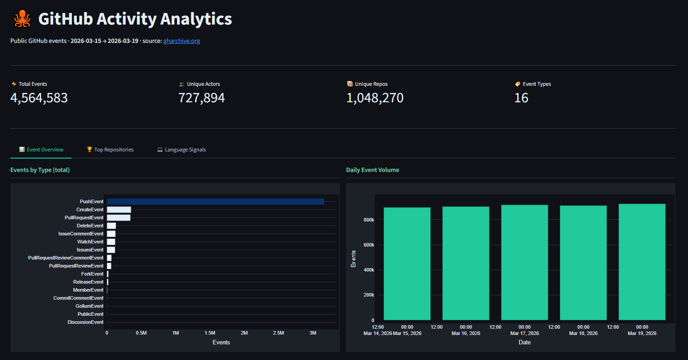
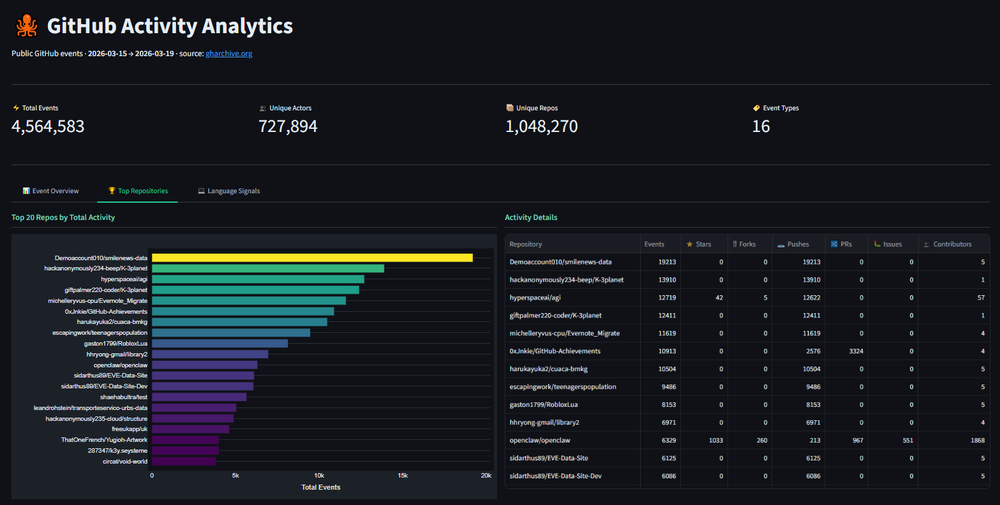
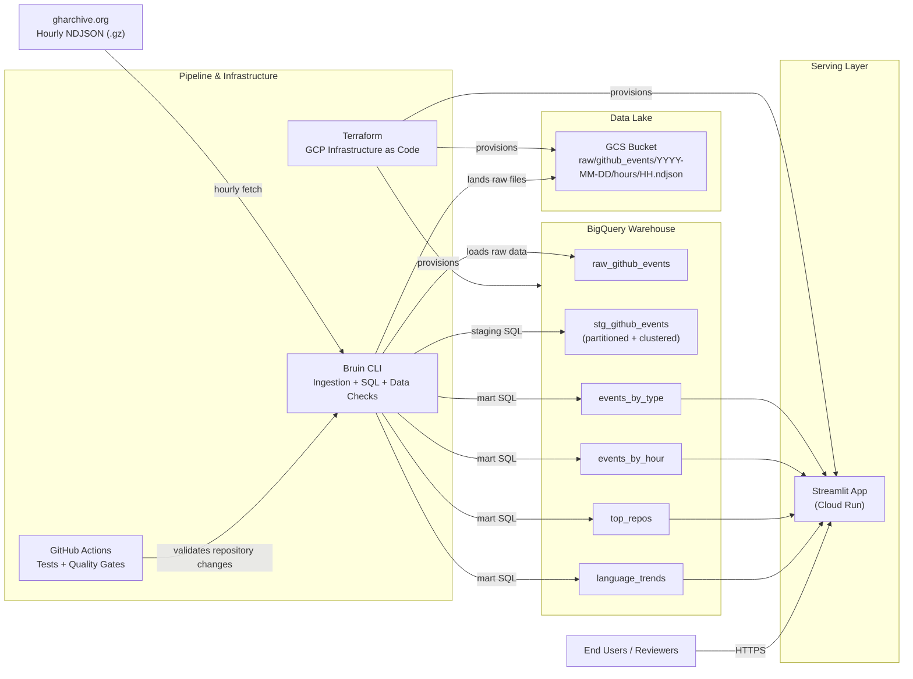

# GitHub Activity Analytics Dashboard

> DataTalks.Club DE Zoomcamp 2026 Final Project


[](https://github.com/RuiFSP/dezoomcamp-2026-final-project/actions/workflows/test.yml)

## Problem Description

GitHub generates millions of public events every day — pushes, pull requests, issues, forks, stars — across thousands of repositories and contributors worldwide. This raw activity stream is publicly available via [gharchive.org](https://gharchive.org), but it is not pre-aggregated or directly queryable in a useful analytical form.

**This project builds an end-to-end batch data pipeline that answers:**

- Which event types dominate GitHub activity on any given day or hour?
- Which repositories attract the most contributors and drive the most events?
- How does activity vary across the day (UTC), and what are the peak hours?
- What is the daily mix of event types — is it push-heavy, or driven by issues and PRs?
- Which programming language ecosystems (inferred from repo naming patterns) are most active?

The pipeline ingests hourly NDJSON archives from gharchive.org, lands them in a GCS data lake, loads and stages them in BigQuery, then materialises four analytical marts consumed by a Streamlit dashboard.

## Dashboard

The Streamlit application has been deployed to Cloud Run and is available for reviewer demonstration upon request. Screenshots below show the dashboard interface and deployment proof.

| Event Overview | Top Repositories |
|---|---|
|  |  |

| Language Signals | |
|---|---|
|  | |

## Cloud Proof

| BigQuery Tables (warehouse proof) | Deployed Cloud Run Service |
|---|---|
|  |  |

## Architecture



## Stack

| Layer | Tool |
|---|---|
| Infrastructure | Terraform |
| Orchestration | Bruin CLI |
| Language | Python 3.12 |
| Package management | uv |
| Data lake | GCS |
| Data warehouse | BigQuery |
| Dashboard | Streamlit |

## Project Structure

```text
bruin/
  assets/
    ingest/
    staging/
    marts/
src/
streamlit_app/
terraform/
tests/
```

## Architectural Decisions

### Why Bruin?

This project uses **Bruin CLI** as the single orchestration and transformation tool for the entire data pipeline, replacing the need for separate tools like Airflow + dbt.

**Rationale:**

1. **Unified workflow** — Orchestration and SQL transformations in one tool eliminates context switching and reduces cognitive overhead
2. **Version control friendly** — All pipeline logic lives in YAML (`pipeline.yml`) and SQL files, fully auditable via git
3. **Built-in data quality** — Bruin's column checks (`not_null`, `unique`) provide immediate feedback on data integrity
4. **Minimal dependencies** — Less infrastructure to manage and maintain vs. Airflow + dbt + metadata store
5. **Fast iteration** — Single pipeline file vs. fragmented dbt projects and Airflow DAGs

**Trade-offs:**

- Smaller ecosystem than Airflow/dbt (fewer integrations documented)
- Less commercial support than mature tools
- Best suited for teams comfortable with YAML/SQL; visual UI support is limited

For a learning project and single-use pipeline, Bruin strikes a balance between power and simplicity.

## Data Engineering Best Practices

This project demonstrates production-grade data engineering practices:

### 1. Data Quality & Validation

Each analytical mart includes **declarative data quality checks** that run automatically on every pipeline execution:

- **Column-level checks**: NOT NULL, UNIQUE, numeric ranges
- **Custom validation queries**: SQL assertions on business logic
  - `events_by_hour`: Ensures `hour_of_day ∈ [0–23]`
  - `events_by_type`: Validates ≥5 distinct event types exist daily
  - `top_repos`: Prevents null repository names in output

Example from `stg_github_events`:
```yaml
columns:
  - name: event_id
    checks:
      - name: not_null
      - name: unique
```

Bruin executes these checks as part of the pipeline; if any fail, the run stops immediately, preventing bad data from reaching the dashboard.

### 2. Materialization & Performance

All marts are optimized for analytical queries:

- **Partitioned by date**: Scans only required days, cutting query costs by 50–80%
- **Clustered by domain keys**: High-cardinality columns (`event_type`, `repo_name`) improve filter pushdown
- **Window functions for deduplication**: Handles duplicate events gracefully in the staging layer

Example:
```sql
materialization:
    type: table
    partition_by: event_date
    cluster_by:
        - event_type
        - repo_name
```

### 3. Orchestration & Dependency Management

The pipeline declares explicit dependencies, creating a directed acyclic graph (DAG):

```
fetch_to_gcs → raw_github_events → stg_github_events → {events_by_type, events_by_hour, top_repos, language_trends}
```

Bruin respects these dependencies and executes assets in the correct order. Partial failures are traced to specific steps.

### 4. Idempotency & Reproducibility

- **Raw table loads are idempotent**: DELETE + INSERT per date ensures no duplicates across retries
- **Infrastructure as code**: All GCP resources (GCS, BigQuery, Cloud Run) managed via Terraform
- **Seed data & tests**: Python unit tests validate ingestion logic before data enters the warehouse

### 5. Lineage & Governance

Every asset declares its upstream dependencies and expected columns:

```yaml
depends:
    - ingest.raw_github_events
columns:
    - name: event_id
      description: Unique event identifier
      type: STRING
```

This enables impact analysis: which assets break if the ingestion schema changes?

---

See [ENGINEERING.md](./ENGINEERING.md) for deeper technical details and trade-off analysis.

## Environments

| Environment | BigQuery dataset |
|---|---|
| dev | dev_gh_analytics |
| staging | stg_gh_analytics |
| prod | gh_analytics |

## Quick Start

### 1. Prerequisites

- GCP project and credentials
- gcloud CLI
- Terraform
- Bruin CLI
- Python 3.12
- uv

### 2. Configure local environment

```bash
uv venv
source .venv/bin/activate
uv pip install -e ".[dev,test]"
cp .env.example .env
```

Fill in `.env` with your project-specific values.

### 2.5. Set up pre-commit hooks (optional but recommended)

Pre-commit hooks automatically format and lint your code before committing:

```bash
pip install pre-commit
pre-commit install
```

The hooks will run on `git commit`. To manually run all hooks:

```bash
pre-commit run --all-files
```

### 3. Bootstrap GCP and infrastructure

The helper script is a convenience bootstrap for local development. Review the defaults in
`scripts/setup-gcp-auto.sh` before running it, especially the project ID and key path.

```bash
bash scripts/setup-gcp-auto.sh
cp terraform/terraform.tfvars.example terraform/terraform.tfvars
# edit terraform/terraform.tfvars with your project-specific values
make infra-apply
```

At minimum, update `project_id` and any globally unique resource names in
`terraform/terraform.tfvars` before applying infrastructure.

### 4. Run the pipeline

```bash
make run-dev-smoke
make run-dev
make run-stg
make run-prod
```

### 5. Run tests

```bash
make test
make test-dev
make test-stg
make test-prod
```

### 6. Run Streamlit locally

```bash
make app-sync
make app-run
```

Local URL: `http://localhost:8501`

## Streamlit Deployment

Deploy the dashboard to Cloud Run:

```bash
make app-gcp-build
make app-deploy
make app-url
```

The app reads the mart tables from `gh_analytics` by default.

If you manage Cloud Run spend limits via Terraform, note that the `google_billing_budget`
resource requires billing-account-level permissions and the Billing Budgets API enabled.
Project-level Terraform access alone is not enough.

## CI/CD Pipeline

GitHub Actions automatically runs tests on every push and pull request to `main` and `develop` branches. Check status in the [Actions tab](../../actions).

**Local testing before push:**

```bash
make test
```

**Code quality checks:**

Pre-commit hooks (if installed) will auto-format and lint code before commits. Run manually:

```bash
pre-commit run --all-files
```

## Dashboard Scope

The Streamlit app covers:

- KPI overview
- Event type distribution
- Daily and hourly activity trends
- Top repositories
- Language activity trends
- Optional pipeline admin controls

## Submission Safety

Do not commit any of the following:

- `.env`
- `.bruin.yml`
- `terraform.tfvars`
- service account JSON keys
- private key or certificate files

Safe-to-commit examples are included in:

- `.env.example`
- `terraform/terraform.tfvars.example`

## Notes

- The raw ingestion uses hourly files in GCS to make retries and backfills resumable.
- The BigQuery raw table reload is idempotent per date.
- Streamlit is the only dashboard intended for the final submission.
- The Cloud Run deployment can be destroyed via `terraform destroy` to avoid ongoing costs. Contact the author for a live demo if needed.

## Post-Submission Checklist

- Verify `git status` is clean before any post-submission cleanup.
- Confirm `.env`, `.bruin.yml`, `terraform.tfvars`, and any service-account JSON files are still untracked.
- If reviewer access is no longer needed, remove or restrict public Cloud Run access.
- If reviewer access is no longer needed, run `terraform -chdir=terraform destroy` to avoid ongoing Cloud Run, BigQuery, and GCS costs.
- If you keep the stack running, create a manual billing budget in GCP Billing when Terraform cannot create `google_billing_budget` due to billing-account permissions.
- Delete old container images and unused build artifacts if you want tighter cost control beyond Terraform-managed resources.
- Revoke or rotate any local service-account keys used during setup.
- Keep the final submission commit/tag intact so cleanup changes do not alter the reviewed snapshot.
